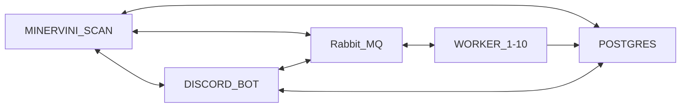

# A STOCKFINDING DISCORD BOT
--------------------------
##### Disclaimer:
this will not find stocks that are "need to buy" but stocks that have potential according to the Mark Minervini's trend template. Always do your own assesments before buying stocks 

----------
##### Description:

This is a Discord bot which scans the Oslo stock market and checks it against Mark Minervini's trend template. it also checks against other indicators, as pivot points, trailing stop, MACD etc.

With the help of RABBITMQ i have multiple worker pod with VPN so I don't get rate limited. Where the worker pods update my DB with the daily report, and then the main file can make the discord embeds from database.

The screen.py can be run as a cronjob to scan entire Oslo børs

Here is a simple diagram to show the flow of information.

--------
##### Credits:  
Big thanks to Richard Moglen for giving me both the idea of making this, and great guides to both python and stock market in general.
https://twitter.com/RichardMoglen  
https://www.youtube.com/@RichardMoglen

Also big thanks to Mr Algovibes on youtube for having some great ideas and tutorials.  
https://www.youtube.com/@Algovibes